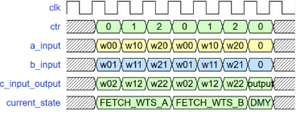
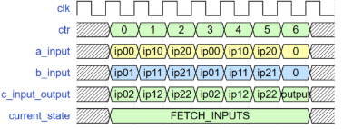
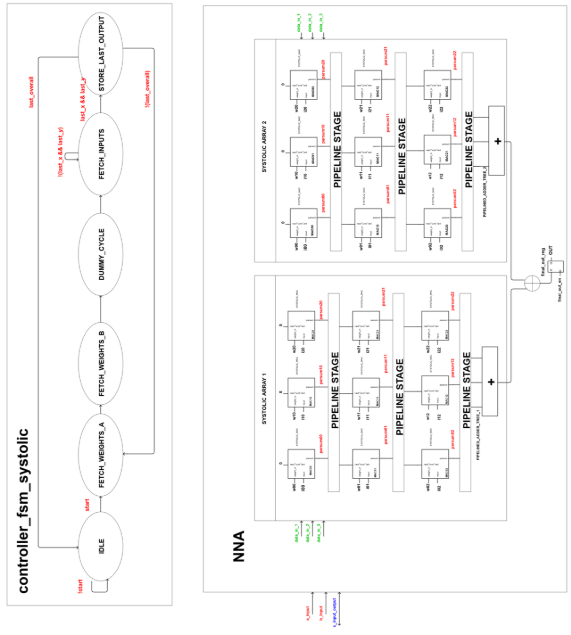

` ` 

Pipelined Systolic Array Based Neural Network

Accelerator

Compute Platforms for AI and Embedded Processing

Muhammad Abdullah Rafique (r0967843) Fadi El Merheby (r0969864)

Academic year 2024-2025

1  Introduction

The aim of this project is to design a neural network accelerator to carry out a convolution operation with the parameters for the input, output and the kernel in Table 1.

|Input Size|Kernel Size|Output Size|Strides|IO Bandwidth|Maximum Area|
| - | - | - | - | - | - |
|128x128x2|3x3x2x16|128x128x16|1,2,4|48 bits|500,000 units|

Table 1: Neural Network Accelerator specifications

2  Design Methodology
1. Design Choices

Inspired by Google’s TPU, it is chosen to implement our neural network accelerator using systolic arrays, which has been reported to be an efficient technique to carry out convolutions due to its weight stationarity. Since we have a bandwidth constraint of 48 bits, it was im- portant to make best use of IO ports. Thus, it was decided to use two input ports a\_input and b\_input, as well as one port that acts as both an input and an output c\_input\_output. c\_input\_output is governed by tri-state buffers on both the top chip and testbench levels to make sure only one side is driving the port. This way the bandwidth is being maximized to minimize latency. All I/O ports used are of 16 bit width. Additionally, the design is pipelined

to reduce latency by having a shorter critical path, which allows to have a higher clock fre- quency. All the registers are 16 bits wide since only least significant 16 bits of the result are considered.

Since there are only two input channels, it was decided to use two systolic arrays to compute both input channels together and eliminate the storage of partial sums in external memory, thus reducing the energy cost of the accelerator and the overall complexity of the circuit. The systolic arrays are identical 3x3 grids of pipelined 16-bit MAC operators, followed by a pipelined adder tree of 3 addends to add the outputs together, thus producing the result of convolution of 1 input channel. Since, the result of both input channel convolutions are to be added, another adder block was used in the top chip, followed by a register that is enabled by an enable signal final\_out\_en. This register is added to avoid glitches due to the delay introduced by the adder block.

The accelerator is governed by a finite state machine controller\_fsm\_systolic that sends control signals to the accelerator to get the correct inputs and outputs. The state machine

has 6 states which are given in Table 2[. ](#_page2_x62.36_y35.30)Moreover, the corresponding convolutional neural network loops for the given design are as below.

for (k = 0 to 15); for each output channel

for (x = 0 to 127); for each in/output column

for (y = 0 to 127); for each in/output row

parfor (c = 0 to 1); for each input channel

parfor (fx = 0 to 2) ; for each kernel row

parfor (fy = 0 to 2) ; for each kernel column

o[x][y][k] = i[x+fx][y+fy][c] \* w[fx][fy][c][k]

|State|Functionality|
| - | - |
|IDLE|Initial state|
|FETCH\_WEIGHTS\_A|Fetches the weights of the first systolic array|
|FETCH\_WEIGHTS\_B|Fetches the weights of the second systolic array|
|DUMMY\_CYCLE|Dummy cycle between weights and inputs that is used to send the last output of previous output channel before going to the next output channel|
|FETCH\_INPUTS|Fetches inputs for both systolic arrays and stores the output if available|
|STORE\_LAST\_OUTP|
UTOccurs when last input vector of the whole computation is

reached. It adds some extra cycles to get this last output.
|

Table 2: States of controller\_fsm\_systolic

2. Functionality

The circuit works as follows: The driver sends a start signal to the top chip through top system,

which sends the state from IDLEto FETCH\_WEIGHTS\_A. The driver then sends the weights to the

first systolic array. One row of weights is stored per clock cycle thus taking a total of 3 clock

cycles for one input channel’s weights. Subsequently, the state becomes FETCH\_WEIGHTS\_B where the same happens for the second input channel’s weights. Further, FETCH\_INPUTSis asserted, and the inputs are sent row by row for first input channel, thus taking 3 clock cycles.

Since the center of the kernel starts at (0,0), there are boundary cases where zeros are sent

to ensure appropriate zero padding for different strides. Therefore, a total of six clock cycles

are used for sending inputs two the both systolic array, whereas the seventh clock cycle is

stalled where no inputs are sent. The seventh cycle is used to send the output of previous computation if it exists, thus using 16-bits c\_input\_output for sending output to the monitor.

The timing diagram of loading of weights is shown in Figure 1.[ Note](#_page2_x62.36_y538.77) that after FETCH\_WEIGHTS\_B, there is DUMMY\_CYCLEstate which exists only to send output of previous computation. Sim-

ilarly, the timing diagram of input loading is shown in Figure 2.[ Here,](#_page3_x62.36_y35.30) the first three cycles

load inputs of first channel, while the second three cycles load inputs of the second channel in

systolic array. The seventh cycle is used to send the output of the previous computation.

Figure 1: Timing diagram for weights

3  Results

The Neural Network Accelerator is simulated with 3 different strides of 1,2 and 4 and a clock period of 1 ns. The results are given in Table 3

Figure 2: Timing diagram for inputs considering all delays and processing times

|Stride|Latency (ns)|Energy (energy units)|EDP (1e9)|Area (area units)|
| - | - | - | - | - |
|1|1,835,122|206,319,315|378,621|150,010|
|2|458,886|51,588,000|23,672|150,010|
|4|114,802|12,904,966|1,482|150,010|

Table 3: Neural network accelerator specifications

It is observed that the accelerator achieves a speed-up of about x15.42 for all strides, with an energy reduction of x1.5. More importantly, the energy-delay product (EDP) goes down by a factor of 23.45 as compared to the initial accelerator made out of 1 MAC unit. Despite the fact that the design uses a lot more registers for pipelining and intermediate result storing, a visible decrease in energy is noticed. This is mainly attributed to the weight reusability that is inherently present in systolic arrays. Additionally, the latency significantly decreases due to the fact that both input channels are processed in parallel and in a pipelined fashion. Further, the available IO bandwidth of 48 bits is almost always being fully used in order to maximize the utilization of the circuit. Although that consumes more energy, but it helps in keeping the MACs busy, thus decreasing latency by a huge factor which decreases EDP.

4  Conclusion

A Neural Network Accelerator is designed using pipelined systolic arrays in order to minimize latency, energy and EDP, while taking into consideration the bandwidth constraint of 48 bits and the area constraint of 500,000 area units. This method proved to be effective in terms of optimizing the data flow and computing results efficiently. Further optimization can still be realized by introducing SRAM and DRAM memory blocks to store variables internally and minimize bandwidth usage. Also, in case of lower stride such as one, only three new inputs need to be fetched for next computation, but this makes FSM quite complicated. The optimizations were not implemented due to lack of time.

5  Appendix

4
